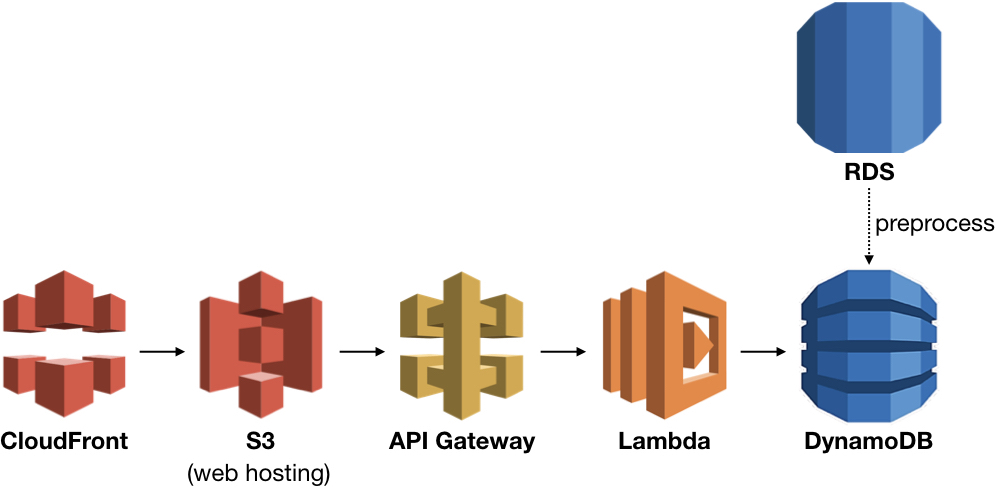

# Table of Contents
1. [Problem](README.md#problem)
2. [Approach](README.md#approach)
3. [Tech Stack](README.md#tech-stack)
4. [Dependencies](README.md#dependencies)
5. [Run](README.md#run)

# Problem

Your cloud storage allows a user to upload contents. The problem, however, is that you charge by the MB used/month and the user wants to minimize cost.

Two files could be named differently, but may contain identical content. Because many users store millions of files, it's practically impossible for them to manually weed out duplicate contents.

Wouldn't it be great if the user can be prompted with a message - at the time of the upload - that a file of the same content already exists?

Some of the challenges to consider include the following:

* The new content will be compared against millions of existing contents.
	* Upload the file to the cloud storage if the content is unique.
	* If a duplicate exists, let the user know and cancel the upload.
* The latency for the scan must be short; the user shouldn't need to wait for more than a few seconds.

# Approach

1. When the user submits a new file, calculate its checksum.
2. Compare the value of the checksum against existing values in the database.
3. If no match is found, then upload the file to S3 bucket.

> In this prototype, the above approach has been simplified:
>
> 1. The user submits a file. Calculate checksum (using [SparkMD5](https://github.com/satazor/js-spark-md5)).
> 2. This invokes API gateway and the lambda function will check the value in DynamoDB.
> 3. The user will get a response of whether or not the content exists.
>
> More feature may be added in the future.

### Preprocessing

The database containing millions of checksum values have already been made using a [batch ETL process](https://github.com/for-loop/duplicate-detector).

The data, however, is stored in PostgreSQL, a relational database. I wonder how the latency compares to NoSQL.

So as a preprocessing step, the data was moved from Postgres to DynamoDB.

# Tech Stack



# Dependencies

### Preprocessing

* Authentication for PostgreSQL. Create the following environmental variables in `.bashrc`:

	```bash
	export POSTGRES_USER=xxxx
	export POSTGRES_PASSWORD=xxxx
	export POSTGRES_HOST=x.x.x.x
	export POSTGRES_PORT=xxxx
	export POSTGRES_DATABASE=xxx
	```

* [boto3](https://github.com/boto/boto3)
* [psycopg2](https://pypi.org/project/psycopg2/)

### Backend

* Environment variables for Lambda function.

	```
	DYNAMODB_TABLE:xxxx
	DYNAMODB_KEY:xxxx
	```

### Frontend

* URL for the API Gateway. Edit `src/frontend/config.js`

# Run

### Preprocessing

1. Move the data from Postgres to DynamoDB.

	```
	python etl_postgres2dynamodb.py <postgres table name> <postgres column name> \
					<dynamodb table name> <dynamodb partition key> \
					[--region <region name>]
	```
